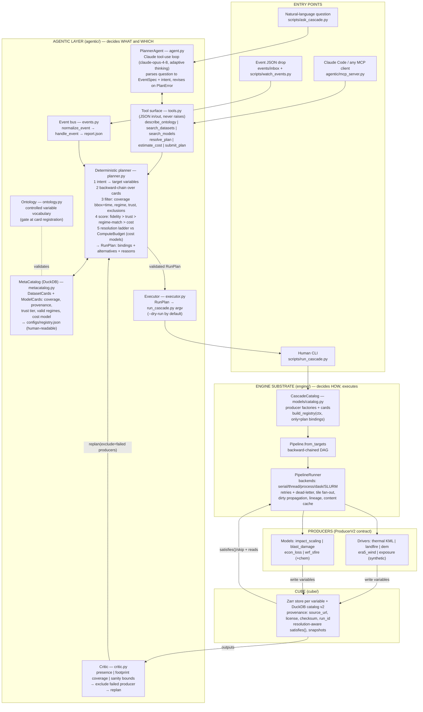
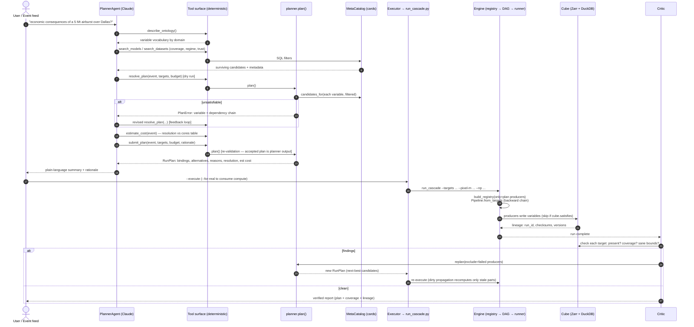
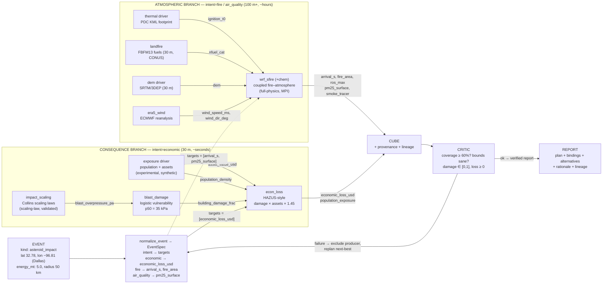

# Agentic Cascade Architecture

Three views: the layered system, the full agent workflow, and the
asteroid-impact example flowing through it.

## 1. Overall architecture (layers)

Design contract: **the LLM proposes, the engine disposes.** The agent
only selects among registered producers and binds parameters; the
accepted plan always comes from `planner.plan()` (re-validated by
`submit_plan`), and execution goes through the same
`run_cascade.py` → engine path humans use — one code path, one lineage
record.

## 2. Agent workflow (end to end)

## 3. Example: cascading impact of an asteroid event

Key behaviour shown here: **focus falls out of backward-chaining.**
Asking for `economic_loss_usd` builds only the consequence branch —
the WRF chain is never constructed, fetched, or paid for. Asking
`full_cascade` builds both. If two producers can supply the same
variable (e.g. a real WorldPop driver alongside the synthetic exposure
driver), the planner's deterministic scoring picks one and records the
other as an alternative — which is exactly what the critic's replan
falls back to when an output fails verification.
