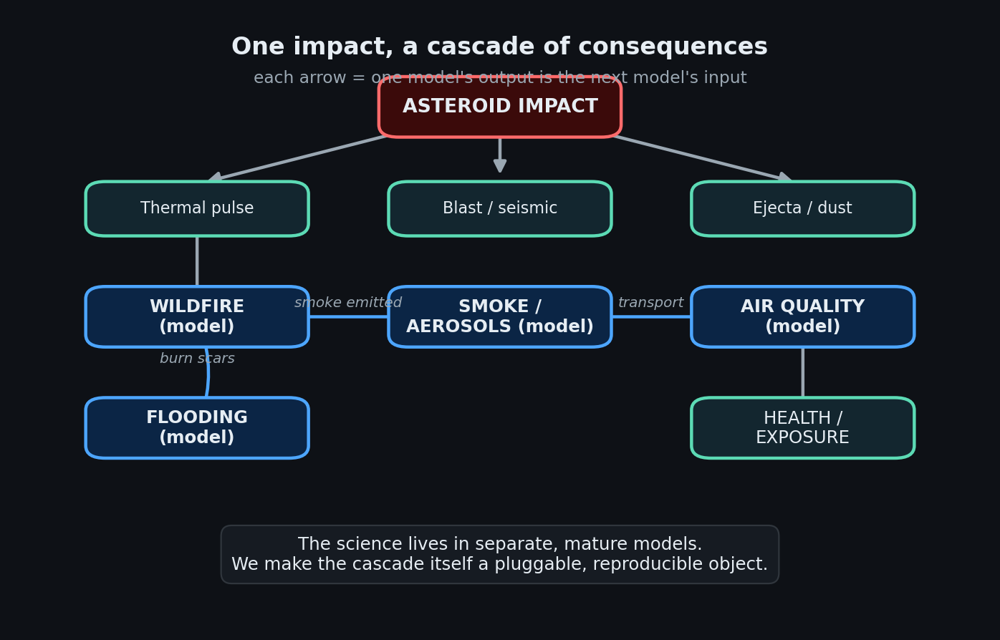
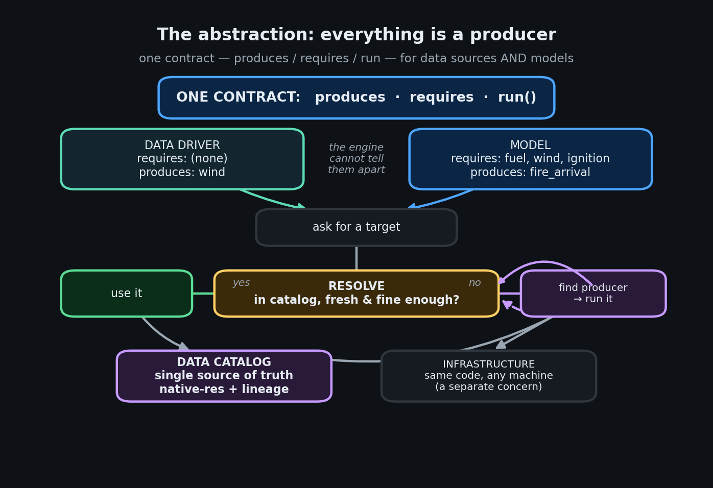
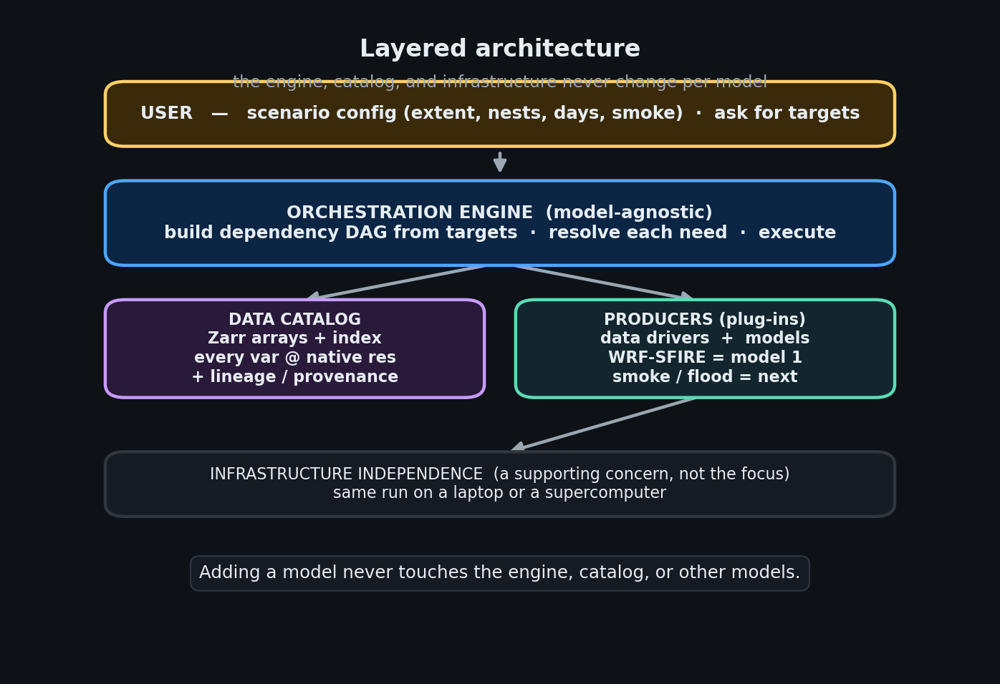
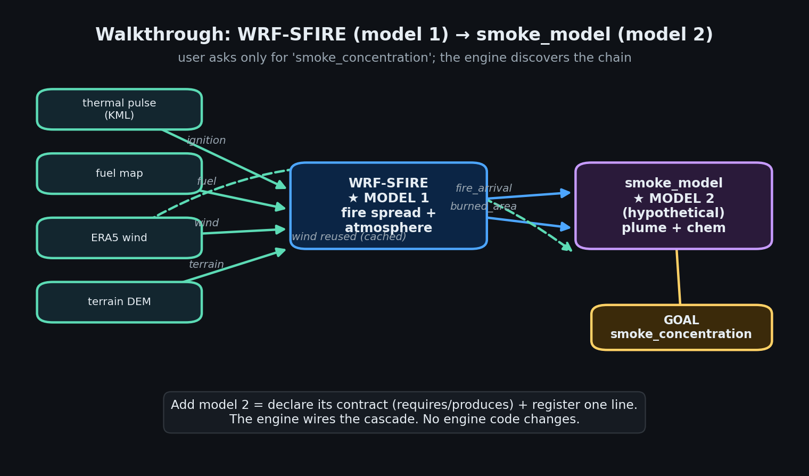
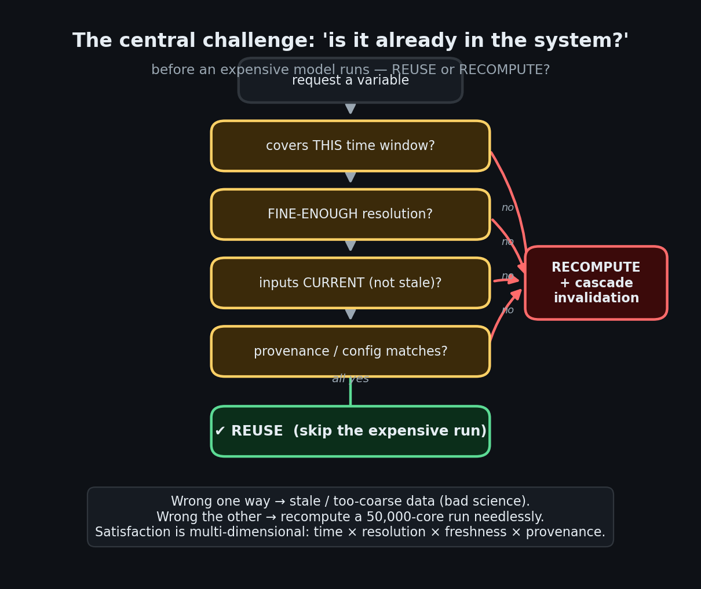

# A Pluggable System for Modeling Asteroid-Impact Cascades
### Design document — from abstractions to implementation

**One sentence.** This system turns a collection of independent
environmental models into a single, reproducible pipeline that predicts
the *chain* of effects following an asteroid impact — by giving every
model and every data source one uniform contract and letting an engine
discover and run whatever is needed to satisfy a request.

This document is written **abstraction-first**: each idea is introduced
as a concept, then grounded in how it is implemented. Infrastructure
concerns (which supercomputer, which job scheduler) are deliberately
kept to the margins — they are a supporting capability, and we flag the
genuinely hard part of them as a challenge rather than a feature.

---

## Table of contents

1. [Motivation — why a cascade needs a system](#1-motivation)
2. [The core abstractions](#2-the-core-abstractions)
   - 2.1 [The Producer](#21-the-producer-the-one-idea)
   - 2.2 [Variables and the Data Catalog](#22-variables-and-the-data-catalog)
   - 2.3 [Dependency resolution — the cascade](#23-dependency-resolution--the-cascade)
   - 2.4 [Merge policies — combining outputs](#24-merge-policies)
3. [Layered architecture](#3-layered-architecture)
4. [Worked example — WRF-SFIRE as model 1](#4-worked-example--wrf-sfire-as-model-1)
5. [Extending — a second model plugs in](#5-extending--a-second-model-plugs-in)
6. [The central challenge — "is it already in the system?"](#6-the-central-challenge)
7. [Supporting concerns](#7-supporting-concerns)
8. [Implementation map](#8-implementation-map)
9. [Glossary](#9-glossary)

---

## 1. Motivation

An asteroid airburst is not a single event with a single consequence.
The thermal pulse ignites wildfires; the fires loft smoke and aerosols;
the smoke degrades air quality over large regions; the burn scars change
the land surface and drive later flooding. **Each effect becomes the
cause of the next.**



The scientific community already has excellent, mature models for each
link in this chain — fire-spread models, chemical-transport models,
hydrology models. The problem is not the physics of any one link. The
problem is the **coupling**:

- The models are written by different groups, in different languages,
  expecting different input formats, and designed to run on different
  machines.
- Wiring one model's output into the next is done by hand, per study,
  with custom glue scripts. The result is fragile, hard to reproduce,
  and nearly impossible to extend to a new link in the chain.

**Our goal** is to make the *cascade itself* a first-class object: a
system where a new model is added by declaring what it needs and what it
produces, and the system figures out the rest — fetching data, running
upstream models, and assembling the chain end-to-end, reproducibly.

---

## 2. The core abstractions

Everything in the system rests on three ideas. None of them mention
fire, smoke, or any specific science — that generality is the point.

### 2.1 The Producer — the one idea

A **producer** is anything that can create a piece of data. It declares
three things and nothing more:

| Declaration | Meaning |
|-------------|---------|
| `produces`  | the variables it can make |
| `requires`  | the variables it needs before it can run |
| `run()`     | how to actually make them |

That is the entire contract. The crucial design decision is that **two
very different things satisfy the same contract**:

- a **data driver** — fetches bytes from the outside world (a reanalysis
  archive, a fuel map, a terrain model) and writes a variable; it
  usually `requires` nothing.
- a **model** — computes a variable *from other variables* (a fire model
  consumes fuel + wind + ignition and produces fire-arrival time).



Because both are "producers", the rest of the system **cannot tell them
apart** — and does not need to. This symmetry is what allows a model to
transparently trigger another model: from the engine's point of view,
"run a download" and "run a 50,000-core simulation" are the same verb.

> **Implementation.** The contract is the `ProducerV2` base class
> (`engine/contracts.py`). Models use a thin specialization,
> `ModelAdapter` (`engine/model_adapter.py`), which adds a familiar
> three-step shape — *stage inputs → run the binary → parse outputs*.
> Data drivers use the `Driver` protocol and are wrapped automatically.
> A registry maps each variable name to the one producer that makes it.

### 2.2 Variables and the Data Catalog

Producers communicate **only** through named **variables** written into
a shared **data catalog**. Nobody passes data to anybody directly; a
producer writes `fire_arrival` into the catalog, and any later producer
that needs `fire_arrival` reads it from the catalog.

The catalog is therefore the system's **single source of truth** and its
**memory**. Critically, every variable is stored with metadata that
later decisions depend on:

- its **native resolution** (how fine the data actually is),
- its **provenance / lineage** (which producer made it, from which
  inputs, under which configuration),
- its **time coverage** (for time-varying fields).

> **Implementation.** The catalog is the *cube* (`cube/`): array data in
> Zarr, an index and metadata in DuckDB. A producer never writes files
> in a model-specific format for another producer to read; it writes a
> variable. This is what makes the pieces composable.

### 2.3 Dependency resolution — the cascade

Given a **target** (the variable the user wants), the system must work
out everything required to produce it, in the right order. It does this
by walking the contracts **backwards**: the producer of the target
declares what it `requires`; each of those is itself produced by some
producer with its own `requires`; and so on, until the chain bottoms out
at data drivers that require nothing.

The result is a **dependency graph** (a DAG) the engine executes in
order. The key property: **the user names only the end goal.** If they
ask for a downstream model's output, every upstream model and data
driver is discovered and run automatically.

> **Implementation.** Two cooperating pieces:
> `Pipeline.from_targets` (`engine/pipeline.py`) builds the DAG by
> walking `requires → produces`; `DataAdapter.resolve`
> (`engine/data_adapter.py`) is the per-variable decision — *is this
> already in the catalog, or must I run its producer?* The same code
> path handles a data download and a nested simulation, because both are
> producers.

### 2.4 Merge policies

When the same variable can be written more than once — for example, a
quantity accumulated over tiles, or a peak intensity seen across several
runs — the producer declares **how writes combine**: keep the latest,
keep the cell-wise minimum (e.g. earliest arrival time), keep the
maximum (e.g. peak intensity), accumulate, or union. This keeps
combination logic *declarative* and out of the models.

> **Implementation.** `MergePolicy` on each output's `VarSpec`
> (`engine/contracts.py`); the catalog applies it on write.

---

## 3. Layered architecture

The abstractions stack into four layers. The top three are completely
generic; only the producers know any science.



- **User layer** — a scenario configuration (area, resolution, nesting,
  duration, which effects to include) and a request for one or more
  target variables.
- **Engine layer** — builds the DAG, resolves each need, executes.
  *Model-agnostic; never edited to add a model.*
- **Producers + Data catalog** — the pluggable science and the shared
  store they read and write.
- **Infrastructure** — runs the work on whatever machine is available.
  A supporting concern (see §7), not the focus.

The single most important property of this picture: **adding a model
never touches the engine, the catalog, or any other model.** A model is
a leaf you attach; the system already knows how to reach it.

---

## 4. Worked example — WRF-SFIRE as model 1

To make the abstractions concrete, here is the first real model wired
into the system: **WRF-SFIRE**, a coupled fire-spread / atmosphere
model. It is the wildfire link of the cascade.

**As an abstraction**, WRF-SFIRE is just a producer:

| | |
|---|---|
| `requires` | `ignition_t0`, `nfuel_cat` (fuel), `dem` (terrain), `wind` |
| `produces` | `arrival_s` (fire arrival time), `fire_area`, and optional diagnostics (rate of spread, intensity, fuel consumed) |

Each requirement is satisfied by a data driver: the ignition field comes
from the impact's thermal footprint, fuel from a land-cover dataset,
terrain from a DEM, wind from a reanalysis archive.

**As an implementation**, the model follows the three-step shape every
model uses:

1. **Stage** — translate catalog variables into the files WRF expects:
   generate the namelist (grid, nesting, physics, optional smoke
   chemistry), and inject the ignition / fuel / terrain fields into the
   model's input file. *The asteroid scenario is expressed as a gridded
   pre-ignition field — the whole impact footprint is ignited — rather
   than a single match.*
2. **Run** — launch the solver. The launch command is supplied by the
   infrastructure layer, so the same model definition runs on any
   machine.
3. **Parse** — read the model's output and write the results back into
   the catalog as `arrival_s`, `fire_area`, etc., at their native
   resolution.

> **Implementation.** `models/wrf_sfire_adapter.py` (the three hooks);
> `models/wrf_config.py` (turns a simple scenario — extent, nest
> resolutions, duration, smoke on/off — into the model's nested
> configuration files). The user-facing knobs live in a single YAML
> (`configs/wildfire_scenario.yaml`).

The takeaway: nothing about WRF-SFIRE leaks into the engine. It is a
producer with a fire-shaped `requires`/`produces`, plus three functions
that know how to talk to the WRF binary.

---

## 5. Extending — a second model plugs in

Now the payoff. Suppose we add a **smoke model** (hypothetical here) that
turns fire output into smoke concentration. As an abstraction it is,
again, just a producer:

- `requires`: `fire_arrival`, `burned_area` (from WRF-SFIRE), `wind`
- `produces`: `smoke_concentration`



The user asks for **`smoke_concentration`** and nothing else. The engine:

1. sees the smoke model needs `fire_arrival`;
2. finds WRF-SFIRE produces it, so schedules WRF-SFIRE first;
3. sees WRF-SFIRE needs ignition, fuel, terrain, wind, and schedules
   those data drivers;
4. runs everything in dependency order;
5. **reuses** the wind field — WRF-SFIRE already pulled it into the
   catalog, so the smoke model gets the cached copy instead of fetching
   it again.

**The entire integration effort** for the new model is:

```
1. declare its contract:   requires = {fire_arrival, burned_area, wind}
                           produces = {smoke_concentration}
2. register it:            catalog.add_model("smoke", ...)     ← one line
```

No engine change. No catalog change. No change to WRF-SFIRE. This is the
property that lets the cascade grow — flooding, air quality, exposure —
each new model simply declaring which upstream variables it consumes.

---

## 6. The central challenge

The abstraction is easy to state. The hard, interesting research problem
is making one specific decision **trustworthy**:

> Before running an expensive model, decide whether what it needs is
> **already in the system** — reuse it — or must be **recomputed**.



This is not the trivial "does the variable exist in the catalog?" A
stored variable might be present but **unusable** for the current
request. True *satisfaction* is **multi-dimensional**:

- **Time coverage** — does the stored field span the requested window?
- **Resolution** — is it fine enough? A 28 km wind field does not
  satisfy a consumer that declared it needs ≤ 1 km.
- **Freshness** — were its inputs since changed? If the ignition field
  was updated, yesterday's fire result is stale.
- **Provenance** — was it produced under a configuration compatible with
  this request?

The cost of getting this wrong is asymmetric and large in **both**
directions:

- Too lax → the system silently reuses stale or too-coarse data, and the
  science is quietly wrong.
- Too strict → the system needlessly recomputes a simulation that may
  cost tens of thousands of core-hours.

And the decision has a second half: when an upstream input *does* change,
the system must **invalidate exactly the affected downstream products** —
no more (or it wastes work), no less (or it serves stale results).

**Our design stance** keeps this as an abstraction rather than scattering
it through the models:

- Producers declare **requirements**, not procedures — e.g. "I need this
  input at ≤ 100 m", not "go fetch it like so".
- The catalog records each variable's **native resolution and lineage**.
- A **single resolver** makes the reuse-vs-recompute decision from that
  metadata.

Because the policy lives in one place, it can be made smarter over time
(richer satisfaction tests, partial reuse across nested grids) without
editing a single model. This is the part we are actively deepening.

---

## 7. Supporting concerns

These matter for a real deployment but are deliberately **not** the
intellectual core of the design.

**Reproducibility & lineage.** Every catalog write records what produced
it, from which inputs, under which configuration. Two identical runs are
identical by construction, and any result can be traced to its sources.
This is what makes the satisfaction decision in §6 possible at all.

**Infrastructure independence — and its real challenge.** Models never
name a machine; the system detects the environment and supplies the
right launch command, so the same run executes on a workstation or a
supercomputer. The *easy* part is emitting the correct command. The
*hard* part — and we call it out as a challenge, not a solved feature —
is making expensive, long-running jobs first-class citizens of the DAG:
submitting them to a batch queue, surviving the wait, resuming after a
failure, and reconciling that asynchrony with the reuse/recompute logic
of §6. Today this layer handles the mechanics; the orchestration of
very large asynchronous jobs is future work.

---

## 8. Implementation map

For readers who want to go from concept to code. (Names are guides, not
the point — the abstractions above are.)

| Concept | Where |
|---------|-------|
| Producer contract | `engine/contracts.py` |
| Model plug-in shape (stage/run/parse) | `engine/model_adapter.py` |
| Build the dependency DAG from targets | `engine/pipeline.py` |
| Resolve a need — reuse vs run its producer | `engine/data_adapter.py` |
| Execute the DAG | `engine/scheduler.py` |
| Data catalog (store + index + lineage) | `cube/` |
| Plug-a-model registry | `models/catalog.py` |
| Model 1 — WRF-SFIRE | `models/wrf_sfire_adapter.py` |
| Scenario → configuration / namelists | `models/wrf_config.py` |
| Data drivers (ignition, fuel, terrain, wind) | `drivers/` |
| Simple user configuration | `configs/wildfire_scenario.yaml` |
| Infrastructure (a supporting concern) | `hpc/` |

---

## 9. Glossary

- **Producer** — anything that creates a variable; declares
  `produces` / `requires` / `run`. Data drivers and models are both
  producers.
- **Data driver** — a producer that fetches external data.
- **Model** — a producer that computes a variable from other variables.
- **Variable** — a named piece of data in the catalog (e.g. `wind`,
  `fire_arrival`).
- **Data catalog** — the shared store all producers read and write; the
  single source of truth.
- **Target** — the variable the user asks for; it drives the whole DAG.
- **Resolver** — the component that decides, per variable, reuse vs
  recompute, and runs producers as needed.
- **Satisfaction** — whether a stored variable is actually usable for a
  request: time × resolution × freshness × provenance.
- **Lineage / provenance** — the record of what produced a variable,
  from which inputs, under which configuration.
- **Cascade** — the chain of models where each one's output feeds the
  next.
