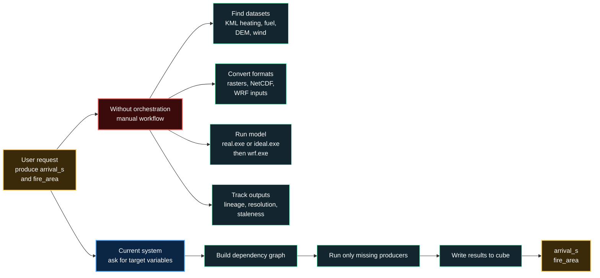
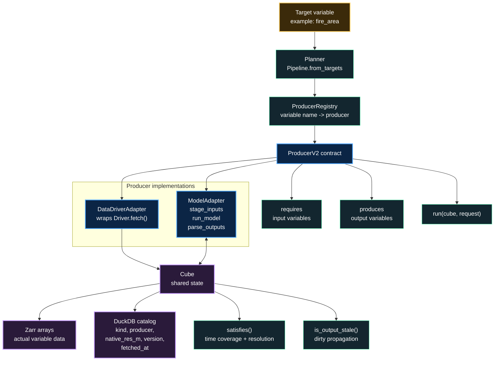
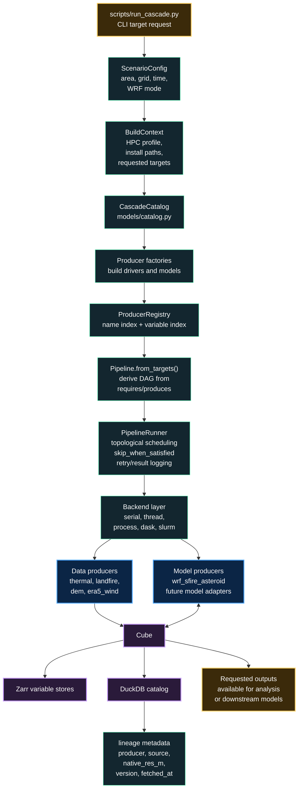

# WRF-SFIRE Cascade Pipeline
### Motivation, abstraction, and overall system architecture
*4 slides - Mermaid diagrams + speaking notes*

> Code-grounded deck based on `scripts/run_cascade.py`, `engine/`,
> `cube/`, `drivers/`, and `models/wrf_sfire_adapter.py`.

---
---

## SLIDE 1 - Motivation: target-driven cascade execution



**Point of the project:** a scientist should request the variable they
want, not hand-wire data access, model staging, execution, and reuse.

- WRF-SFIRE is already an external HPC model with strict input/output
  expectations.
- Its inputs come from independent data producers.
- The pipeline turns a target variable into an executable dependency
  graph and records the result in a shared cube.

### Speaking Notes
"The motivation is that cascade simulation should not be a hand-built
script for every experiment. For WRF-SFIRE, we need impact ignition,
fuel, terrain, and weather. Then we have to stage WRF files, run the
binary, parse outputs, and remember what was produced. The current
system changes the unit of work: instead of saying 'run these scripts',
the user says 'produce these target variables'. The engine figures out
which data and models are needed."

---
---

## SLIDE 2 - Abstraction: variables, producers, and the cube



**Key abstraction:** the engine never depends on model names. It depends
on canonical variable names.

- A data source and a model both materialize variables.
- A producer declares `requires`, `produces`, and `run`.
- `DataNeed` and `VarSpec` carry variable metadata such as kind, units,
  native resolution requirements, and merge policy.
- The cube is the shared memory of the cascade.

### Speaking Notes
"This is the core abstraction. Everything is a producer of variables.
A data driver produces variables by fetching external data. A model
produces variables by computing from other variables. The engine treats
both the same way. It asks the registry: who can produce `fire_area`?
Then it walks backward through requirements until all upstream variables
are satisfied in the cube. The cube is not just storage; it is also the
place where reuse decisions happen."

---
---

## SLIDE 3 - Overall system architecture from the code



**Implemented architecture:**
- `run_cascade.py` creates the scenario, registry, pipeline, cube, and
  runner.
- `default_catalog()` registers the built-in data producers and
  WRF-SFIRE.
- `Pipeline.from_targets()` creates a target-driven DAG.
- `PipelineRunner` executes the DAG through a backend.
- The cube records both arrays and catalog metadata for reuse and
  provenance.

### Speaking Notes
"This is the overall architecture as it exists in the code. The command
line target flows into scenario configuration and build context. The
catalog instantiates producers. The registry maps every variable to the
producer that can create it. The planner turns targets into a DAG, and
the runner executes that DAG through a backend. Data producers and model
producers both read and write the same cube, so downstream models can
consume upstream outputs without any direct coupling."

---
---

## SLIDE 4 - Current implementation: WRF-SFIRE as model 1

```mermaid
`flowchart TB
    subgraph INPUTS["Variables required by WRFSFireAdapter"]
        I1["ignition_t0<br/>from ThermalDriver"]
        I2["nfuel_cat<br/>from LandfireFBFM13Driver"]
        I3["dem<br/>from DEMDriver"]
        I4["wind_speed_ms<br/>wind_dir_deg<br/>optional ERA5WindDriver"]
    end

    I1 --> FETCH["DataDriverAdapter<br/>writes inputs into cube"]
    I2 --> FETCH
    I3 --> FETCH
    I4 -. "optional" .-> FETCH
    FETCH --> CUBE1["Cube input state"]

    CUBE1 --> WRF["WRFSFireAdapter<br/>ModelAdapter subclass"]

    WRF --> STAGE["stage_inputs()<br/>templates, namelists,<br/>wrfinput, TIGN_IN,<br/>NFUEL_CAT, ZSF"]
    STAGE --> EXEC["run_model()<br/>real.exe or ideal.exe<br/>wrf.exe via HPC profile"]
    EXEC --> PARSE["parse_outputs()<br/>read wrfout<br/>block-reduce fire mesh"]

    PARSE --> CUBE2["Cube output state"]
    CUBE2 --> O1["arrival_s"]
    CUBE2 --> O2["fire_area"]
    CUBE2 --> O3["optional diagnostics<br/>ros_max, fire_intensity,<br/>fuel_consumed"]
    CUBE2 --> O4["optional WRF-Chem outputs<br/>pm25_surface,<br/>smoke_tracer"]

    CUBE2 --> NEXT["Next model adapter<br/>declares DataNeed(arrival_s)<br/>and is pulled into the DAG"]

    classDef input fill:#13262f,stroke:#6fb,color:#fff;
    classDef adapter fill:#0b2545,stroke:#4da6ff,color:#fff,stroke-width:2px;
    classDef store fill:#2a1a3a,stroke:#c79bff,color:#fff,stroke-width:2px;
    classDef output fill:#3b2a0a,stroke:#ffd166,color:#fff,stroke-width:2px;
    class I1,I2,I3,I4 input;
    class FETCH,WRF,STAGE,EXEC,PARSE,NEXT adapter;
    class CUBE1,CUBE2 store;
    class O1,O2,O3,O4 output;`
```

**Why this validates the design:**
- WRF-SFIRE is a real external model wrapped without changing the engine.
- The adapter translates cube variables into WRF-specific files, then
  translates WRF output back into cube variables.
- The same registry and DAG mechanism can place another model after
  WRF-SFIRE if it requires `arrival_s` or `fire_area`.

### Speaking Notes
"WRF-SFIRE is the implemented proof point. It is a `ModelAdapter`, so
the engine sees the same contract as every other producer. Internally,
the adapter does the messy model-specific work: staging namelists and
NetCDF inputs, invoking WRF through the detected HPC profile, and parsing
`wrfout` back into cube variables. The important architectural point is
that this complexity is contained inside the adapter. The pipeline only
sees variables, dependencies, and outputs."
