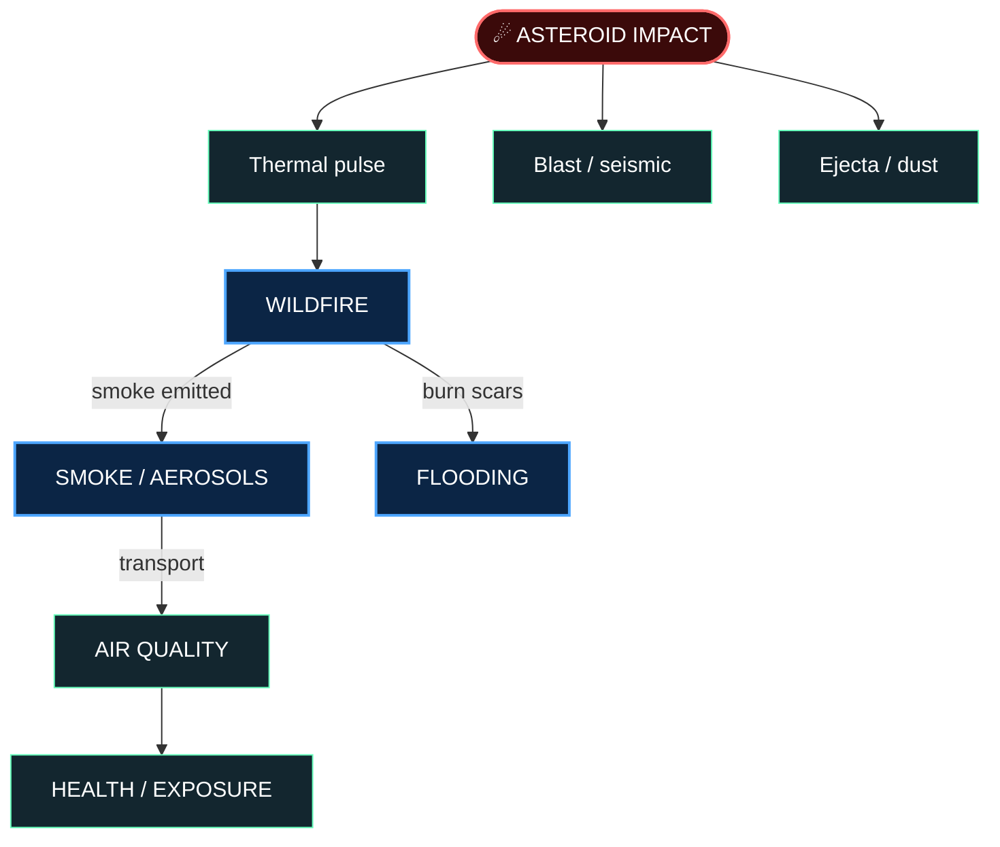
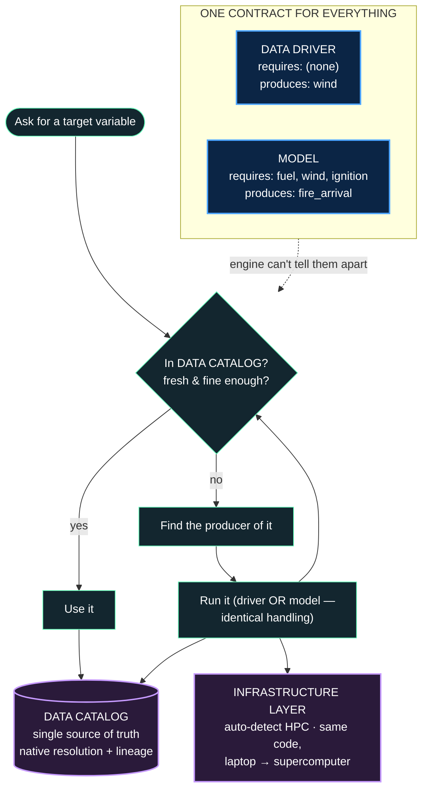
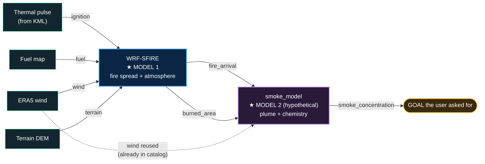
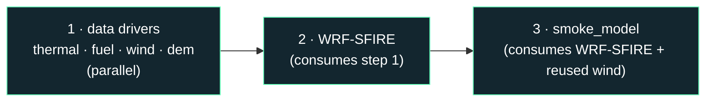
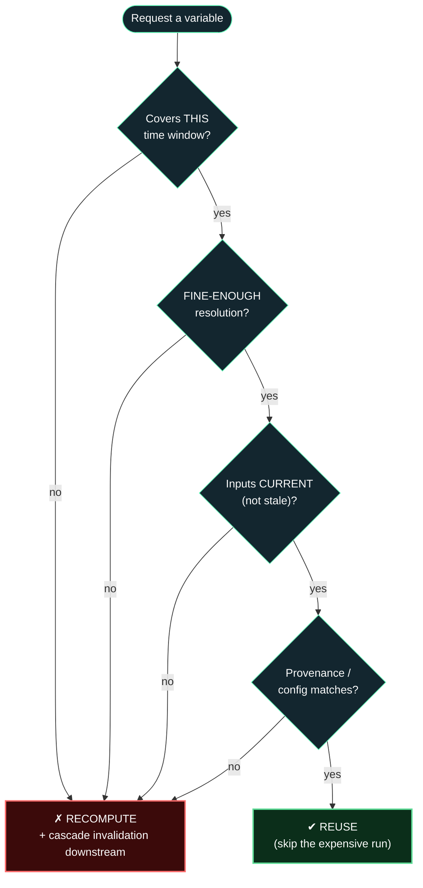

# Predicting the Cascading Effects of an Asteroid Impact
### A pluggable, infrastructure-independent multi-model system
*4 slides · Mermaid diagrams + speaking notes · audience: NASA*

> Diagrams render in VS Code (Markdown Preview) and on GitHub. Screenshot
> each diagram into PowerPoint/Keynote, or present this file directly.
> ASCII fallback version: `docs/presentation.md`.

---
---

## SLIDE 1 — Why: one impact, a cascade of consequences



**Every arrow = one model's output is the next model's input.**

- One impact triggers **interacting** processes: fire → smoke → air
  quality; burn scars → flooding.
- The science lives in **separate, mature models** (WRF-SFIRE, chemical
  transport, hydrology) — different teams, languages, machines.
- No single tool spans the cascade; hand-stitching is fragile and
  unreproducible.

> **What we built:** a system where any model **plugs in**, shares one
> **data catalog**, and the engine **automatically runs whatever upstream
> models it depends on** — so the cascade runs end-to-end, reproducibly.

### 🎤 Speaking notes
"An airburst doesn't cause one effect — it sets off a chain. The thermal
pulse ignites fires, fires loft smoke, smoke degrades air quality, burn
scars later drive flooding. Each link is a serious model maintained by a
different community. Today, coupling them is heroic and not repeatable.
Our goal: make the **cascade itself** a reproducible object — plug models
in, let the system wire them together. I'll show the abstraction, then
walk it through with a fire model and a smoke model."

---
---

## SLIDE 2 — The abstraction: everything is a *producer*



**Three abstractions — nothing model-specific:**
1. **Producer** — uniform contract (`produces` / `requires` / `run`).
   Data sources and models are *the same kind of thing*.
2. **Data catalog** — one place all producers read/write; the system's
   memory + reproducibility anchor.
3. **Resolver** — given a goal, finds and runs whatever satisfies it,
   recursively. Zero domain knowledge.

### 🎤 Speaking notes
"Here's the whole idea on one slide. We force *everything* — every data
source and every model — through one tiny contract: what you produce,
what you require, how to run. The engine reads only that; it has no
domain knowledge. Ask for a result, and the resolver checks the shared
catalog: if the data is there, fresh, and fine enough, reuse it;
otherwise find the producer and run it — and that producer might be a
data download *or* another model. Same handling. That symmetry is the
trick that lets a model transparently trigger another model. And since
models never name a machine, the same run executes on a laptop or a
supercomputer."

---
---

## SLIDE 3 — Walkthrough: WRF-SFIRE (model 1) → smoke_model (model 2)



**Execution order the engine derives (topological):**



**Plug in model 2 — the entire integration:**
```text
1. declare its contract:   requires = {fire_arrival, wind}
                           produces = {smoke_concentration}
2. register it:            catalog.add_model("smoke", …)   ← one line
→ the engine wires the cascade. No engine code changes.
```

### 🎤 Speaking notes
"Concretely: the user asks for *smoke concentration* — nothing else. The
engine reads smoke_model's contract, sees it needs fire arrival time,
finds WRF-SFIRE produces it, sees WRF-SFIRE needs ignition, fuel, wind,
terrain — pulls those from data drivers. It runs everything in
dependency order. Note the wind: WRF-SFIRE already used it, so when
smoke_model also needs it, the catalog hands back the cached copy — no
recompute. To add the smoke model, a scientist writes a three-line
contract and registers it with one line. They never touch the engine,
the catalog, or the fire model. That's how the third, fourth, tenth
model goes in too."

---
---

## SLIDE 4 — The hard part: *"is it already in the system?"*



> Wrong one way → silently use **stale / too-coarse** data (bad science).
> Wrong the other → **recompute a 50,000-core run** needlessly.

**Why this is the real research problem**
- The abstraction is easy to state, hard to make **trustworthy**.
- "Satisfaction" is **multi-dimensional**: time × resolution × freshness
  × provenance — not "does the key exist?"
- One changed input must invalidate **exactly** the affected downstream
  products — no more, no less.

**Design stance — abstractions over implementations**
- Producers declare *requirements* ("≤ 100 m"), not procedures.
- The catalog records *native resolution + lineage* per variable.
- One resolver decides reuse-vs-recompute from that metadata — policy in
  **one place**, not smeared across every model.

**Roadmap**

```mermaid
flowchart LR
    subgraph DONE["✔ Working today"]
        A["uniform producer contract"]
        B["recursive cascade resolution"]
        C["data catalog + lineage"]
        D["infrastructure independence"]
        E["WRF-SFIRE = model 1, validated"]
    end
    subgraph NEXT["◻ Next"]
        F["richer satisfaction calculus"]
        G["partial / tiled reuse across nests"]
        H["more models: smoke, flood, exposure"]
        I["cross-model uncertainty propagation"]
    end
    DONE ==> NEXT
    classDef done fill:#0b2e1a,stroke:#5cdb95,color:#fff;
    classDef next fill:#3b2a0a,stroke:#ffd166,color:#fff;
    class A,B,C,D,E done;
    class F,G,H,I next;
```


### 🎤 Speaking notes
"Finally, the honest part. The abstraction is simple to describe; making
it *trustworthy* is the research. The crux: before launching an
expensive model, decide whether what we need is *already in the system*.
That's not 'does the key exist' — it's: do we have it for this time
window, at fine-enough resolution, from current inputs, with matching
provenance? Err one way, you run on stale or coarse data — bad science.
Err the other, you burn a fifty-thousand-core run you didn't need. Our
stance keeps this an *abstraction*: producers declare requirements, the
catalog records resolution and lineage, one resolver makes the decision —
so the policy lives in a single place. We have the contract, the
recursive cascade, the catalog, and infrastructure independence working,
with WRF-SFIRE as the validated first model. Next: a richer satisfaction
calculus, partial reuse across nested grids, and more models in the
chain. Thank you — happy to go deeper on any layer."
