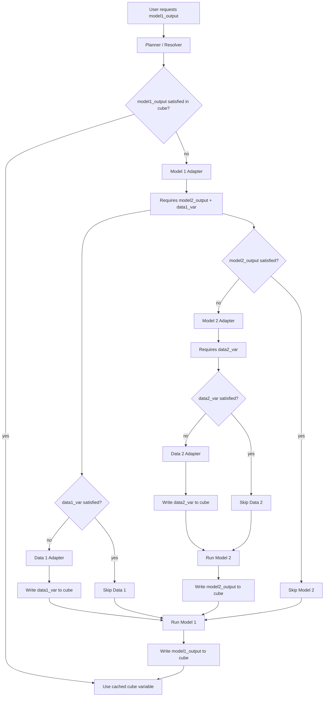

# Variable-Centric Model Execution Design

This project is moving toward a model-agnostic dependency engine. The central
rule is:

```text
Everything is a producer of named cube variables.
```

Data access, model execution, and external file-format conversion are hidden
behind the same producer contract. The resolver only sees declared variables.

## Overall Flow



## Producer Contract

Every adapter should expose the same boundary:

```python
class MyProducer(ProducerV2):
    name = "my_producer"
    requires = (VarSpec("input_var", kind="static"),)
    produces = (VarSpec("output_var", kind="time"),)

    def run(self, cube, request):
        ...
        return {"output_var": 0}
```

The producer may be a data adapter, an in-process model, or a wrapper around an
external executable. The engine does not need to know which.

## Adapter Responsibilities

Data adapters:

```text
provider-specific search/access/reprojection -> canonical cube variables
```

Model adapters:

```text
canonical cube variables
  -> model-specific input format
  -> run model
  -> parse model-specific output
  -> canonical cube variables
```

The model-specific format can be NumPy arrays, GeoTIFF, NetCDF, CSV, WRF input
files, or anything else. That conversion belongs inside the adapter.

## Cube Reuse Rule

Before running a producer, the scheduler asks the cube whether the producer's
outputs are already satisfied:

```text
cube.satisfies(VarSpec(...), request)
```

The cube checks:

```text
variable exists
kind matches static/time
requested time window is covered
native resolution is acceptable, when declared
```

If all produced variables are satisfied, the producer is skipped. This is the
cache boundary: a model does not redownload or recompute inputs that are
already available in the cube.

## Migration Path

1. Keep existing drivers and model functions working.
2. Wrap old data drivers with `DataDriverAdapter`.
3. Wrap old model functions with `ModelFunctionAdapter`.
4. Migrate important models to direct `ProducerV2` subclasses as they evolve.
5. Keep the resolver and scheduler variable-centric.

The result is a scalable cascade system: adding a new model means registering
one producer that declares `requires` and `produces`, not editing the whole
pipeline.
